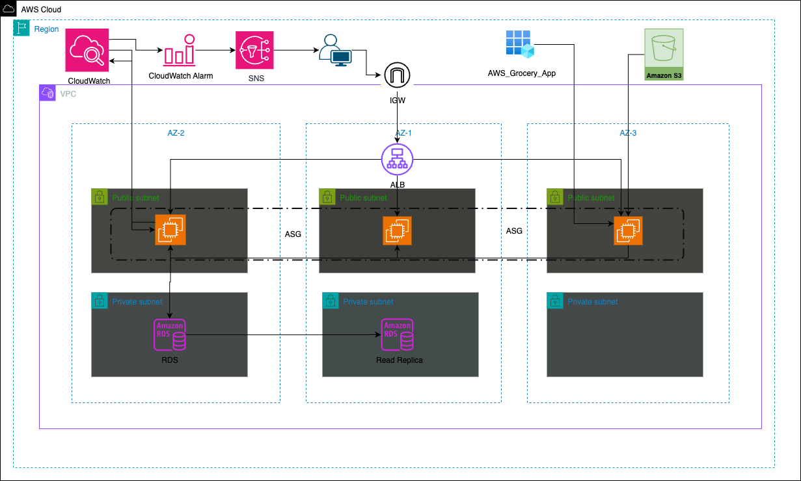

# Masterschool AWS Grocery App Deployment

## **About**

This project is part of the Cloud Track in the Masterschool Software Engineering bootcamp. The app was built by our mentor Alejandro Román. Our task was to design and deploy the **AWS infrastructure** step by step using **Terraform**.

I focused on implementing each AWS component to ensure a scalable and reliable setup. The goal was to practice and learn about AWS and Terraform with this hands-on Project.

For app features and local install instructions, see [`README.md`](app.md).

This Repo covers only the AWS infrastructure and deployment.

## Architecture Diagram
A full architecture diagram has been designed showing:

- Custom VPC with 3 AZs  
- EC2 instances in Auto Scaling Group behind an Application Load Balancer  
- RDS + Read Replica in private subnets  
- S3 access outside the VPC  
- CloudWatch → Alarm → SNS → Email alert flow



---

## AWS Services Used

| **AWS Service**       | **Purpose** |
|-----------------------|-------------|
| **EC2 (ASG)**         | Hosts the Flask application across 3 AZs |
| **Amazon RDS**        | Primary database |
| **Read Replica**      | Offloads read queries |
| **Application Load Balancer (ALB)** | Distributes traffic efficiently |
| **S3 Bucket**         | Stores avatars |
| **CloudWatch + Alarms** | Monitors EC2 metrics |
| **SNS**               | Sends email alerts |
| **IAM Roles**         | Secure access from EC2 to S3 & CloudWatch |
| **Security Groups**   | Network access control |
| **Custom VPC**        | Isolated, secure networking environment |

---

## Services worth mentioning

| **Service**             | **Purpose**                                   |
|-------------------------|-----------------------------------------------|
| **Docker & docker-compose** | Containerization of the backend & frontend |

---

## Custom VPC and Network Design

- Custom VPC across 3 Availability Zones
- **3 Public Subnets** for EC2/ALB/ASG  
- **3 Private Subnets** for RDS and Read Replica  
- Internet Gateway for public subnet internet access  
- Security Groups for traffic control  
- No NAT Gateway (public EC2s, private RDS doesn't require internet)

---

## Deploying EC2 Instances via Auto Scaling Group (ASG)

The application runs on 3 EC2 instances using an **Auto Scaling Group** for fault tolerance.

### Key Configurations
- **AMI:** Custom AMI with Docker and app preinstalled
- **Instance Type:** `t3.micro`
- **Auto Scaling Group:** Maintains 3 instances across 3 AZs
- **IAM Role:** Enables access to S3 and CloudWatch
- **ALB:** Routes HTTP traffic to EC2s
- **User Data:** Installs CloudWatch agent and starts Docker

### Terraform Code Snippet (ASG)
```hcl
resource "aws_autoscaling_group" "app_asg" {
  name                      = "grocery-asg"
  desired_capacity          = 3
  min_size                  = 3
  max_size                  = 3
  vpc_zone_identifier       = var.public_subnet_ids
  launch_template {
    id      = aws_launch_template.app_launch_template.id
    version = "$Latest"
  }
  target_group_arns         = [aws_lb_target_group.instances.arn]
  health_check_type         = "EC2"
  health_check_grace_period = 300
  force_delete              = true
}
```
---

## Application Load Balancer (ALB)

Distributes traffic across EC2s in all 3 AZs via the ASG.

✔️ Handles auto-scaling  
✔️ Ensures fault tolerance  
✔️ Publicly accessible via HTTP (port 80)

### Note:
No manual target attachment is needed — **ASG handles target registration**.

---

## Amazon RDS + Read Replica

- **Primary RDS instance** in one private subnet  
- **Read Replica** in a different AZ/private subnet  
- PostgreSQL engine  
- Publicly inaccessible (private subnets only)  
- EC2s access RDS via security group rules  

---

## S3 Avatar Storage

User-uploaded avatars are stored in **Amazon S3**, not on EC2 instances.

✔️ Improves performance  
✔️ Offloads EC2 disk usage  
✔️ Regional, outside the VPC  

`.env` snippet:
```env
S3_BUCKET_NAME=your-bucket-name
S3_REGION=eu-central-1
USE_S3_STORAGE=true
````
---

## IAM Roles

**IAM roles** assigned to EC2 allow secure access to:

- S3 bucket  
- CloudWatch agent & logs  

Avoids hardcoded credentials.

---

## CloudWatch Monitoring & Alerts

Monitors EC2 instance performance:

- ✅ CPU utilization  
- ✅ Disk usage (via CloudWatch Agent)  
- ❌ RDS metrics (not yet implemented)  

### Disk Monitoring Config
```json
{
  "metrics": {
    "metrics_collected": {
      "disk": {
        "measurement": ["used_percent"],
        "resources": ["*"]
      }
    }
  }
}
```
### Alerting Flow

- CloudWatch Alarm monitors EC2 metrics (e.g., CPU or disk usage).
- When the threshold is breached (e.g., CPU > 80%), it triggers an alarm.
- The alarm is connected to an **SNS Topic**.
- SNS sends an **email notification** to the configured subscriber.

**Email Variable:**

You can set the recipient email as a variable in Terraform using the **.tfvars**:

```hcl
variable "alert_email" {
  description = "Email to receive CloudWatch alerts"
  type        = string
}
```

**Usage in SNS Subscription:**
```hcl
resource "aws_sns_topic" "cloudwatch_alerts" {
  name = "cloudwatch-alerts"
}

resource "aws_sns_topic_subscription" "email_subscription" {
  topic_arn = aws_sns_topic.cloudwatch_alerts.arn
  protocol  = "email"
  endpoint  = var.alert_email
}
```
**After Deployment:**

You will receive a confirmation email from AWS to confirm the subscription.
No alerts will be sent until the email is confirmed.

---

## Deployment Steps

**Initialize Terraform**
```bash
terraform init
```
**Review the plan**
```bash
terraform plan
```
**Apply the Infrastructure**
```bash
terraform apply -auto-approve
```
**Connect to a running EC2 instance**
```bash
ssh -i your-key.pem ec2-user@<public-ip>
```
**Start the app using docker**
```bash
cd /home/AWS_grocery
sudo docker-compose up -d --build
```
**Access the app**
```bash
http://<your-alb-dns-name>
```
**Monitor logs in real-time**
```bash
aws logs tail /aws/ec2/syslog --follow
```
**Dont forget to Teardown all resources when your done**

**It could kill your wallet pretty fast**
```bash
terraform destroy -auto-approve
```


